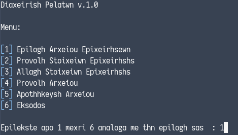
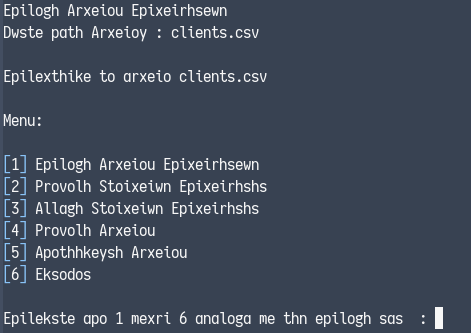
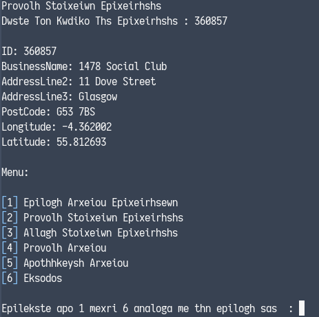

# Operating Systems Lab 2014
This repository contains four course assignments for the **Operating Systems Lab** university course for the
academic period of 2014-2015 done by <a href="https://github.com/PARVD0XSVPR3ME">Panagiotis Charalampopoulos</a>.

## Assignment 1

Developed a Bash shell script that displays a menu where the user can:



1. Select a `.csv` file (by entering its path) that contains information about different businesses (id, name, address, post code,
   longitude, latitude).

   

2. View information about a specific business by entering its id.

   
3. Alter a business information item by entering the business id and item name.

   
4. View information about all the available businesses.

   
5. Save as a new file by entering a path.

   
6. Exit the script

### Compilation Instructions

```bash
gcc -o mysh4 mysh4.c
```


### Usage

```bash
./mysh4
```


## Assignment 2
### Compilation Instructions

```bash
gcc -o mysh4 mysh4.c
```

### Usage

```bash
./mysh4
```


## Assignment 3
## Assignment 4

# License
All files are licensed under the  [AGPL-3.0](https://www.gnu.org/licenses/agpl-3.0.en.html)

Copyright © <a href="https://github.com/PARVD0XSVPR3ME">Panagiotis Charalampopoulos</a>
