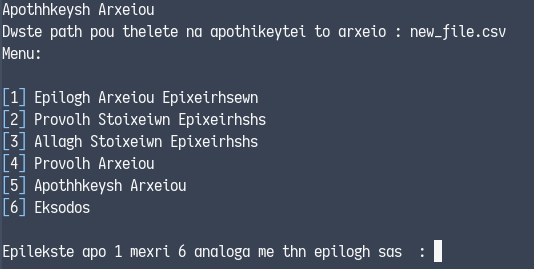

# Operating Systems Lab 2014
This repository contains four course assignments for the **Operating Systems Lab** university course for the
academic period of 2014-2015 done by <a href="https://github.com/PARVD0XSVPR3ME">Panagiotis Charalampopoulos</a>.

## Assignment 1

Developed a Bash shell script that displays a menu where the user can:


1. Select a `.csv` file (by entering its path) that contains information about different businesses (id, name, address, post code,
   longitude, latitude).

   

2. View information about a specific business by entering its id.

   
3. Alter a business information item by entering the business id and item name.

   
   
4. View information about all the available businesses.

   
5. Save as a new file by entering a path.

   

6. Exit the script

### Usage

```bash
./first/5681_ex1.sh
```

## Assignment 2

Performed the following modifications to the **Minix 3.0.0** operating system.
   1. Modified the `do_mkdir()` system call so that when we create a new directory using the `mkdir` command,
      the new directory name and its access rights will appear on the screen:

      `New dir -> folder_name,access_rights`
   2. Modified the `SYS_FORK` kernel call that is called by the **Process Manager** in order to create a new
      process, so that when the kernel updates the process table, the message `process scheduled!\n` will
      appear on the screen.
   3. Implemented a new system call that behaves like `do_mkdir()` except that it prints the **absolute path** to
      the new directory and its **access rights** when mkdir command is used.
   4. Implemented a new system call that prints the total number of running processes as well as the total
      user and sys time of all child processes.
   5. Implemented a new command that takes an integer as an argument, that corresponds to a process id and
      returns information about whether or not a process with that process id is running on the system. A
      system call that is used by the newly created command is also implemented.


## Assignment 3

Performed the following modifications to the **Minix 3.0.0** operating system.
   1. Modified `usr/src/servers/vm/alloc.c` in order to implement **best-fit** memory allocation instead of
      **first-fit**

## Assignment 4

This assignment is about understanding the internals of the `Minix file system`.

Contains my answers (in Greek) to the following questions:

1. What is a `super block`?
2. How many `super blocks` are there in a `Minix` system (per directory, per file, per device, per partition)?
3. What is a `block`?
4. What is a `zone` and what is its purpose? Why it's not enough to just use `blocks`.

# License
All files are licensed under the  [AGPL-3.0](https://www.gnu.org/licenses/agpl-3.0.en.html)

Copyright © <a href="https://github.com/PARVD0XSVPR3ME">Panagiotis Charalampopoulos</a>
